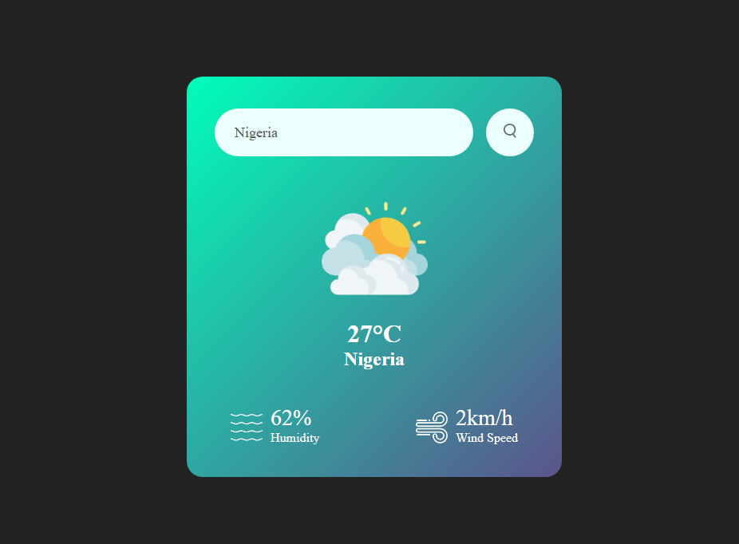

# Weather App



A mini weather app project for learning JavaScript. Search for the current weather in any city. The app uses a simple Node.js/Express backend to securely fetch data from the OpenWeatherMap API, keeping your API key safe. Great for practicing JavaScript and API integration.

## Features

- Search for current weather by city name
- Displays temperature, humidity, wind speed, and weather icon
- Responsive and easy-to-use interface
- API key is hidden from the frontend using a backend proxy

## How It Works

- The frontend sends a request to the backend with the city name.
- The backend fetches weather data from OpenWeatherMap using a secret API key stored in a `.env` file.
- The backend returns the weather data to the frontend for display.

## Getting Started

1. **Clone the repository:**
   ```bash
   git clone https://github.com/yourusername/weather-app.git
   cd weather-app
   ```

2. **Install dependencies:**
   ```bash
   npm install
   ```

3. **Create a `.env` file in the project root:**
   ```
   API_KEY=your_openweathermap_api_key
   API_URL=https://api.openweathermap.org/data/2.5/weather
   ```

4. **Start the server:**
   ```bash
   node server.js
   ```

5. **Open your browser at** [http://localhost:3000](http://localhost:3000)

## Project Structure

- `server.js` — Node.js/Express backend
- `script.js` — Frontend JavaScript
- `.env` — Environment variables (not committed to git)
- `index.html`, `style.css`, `images/` — Frontend assets

## License

MIT